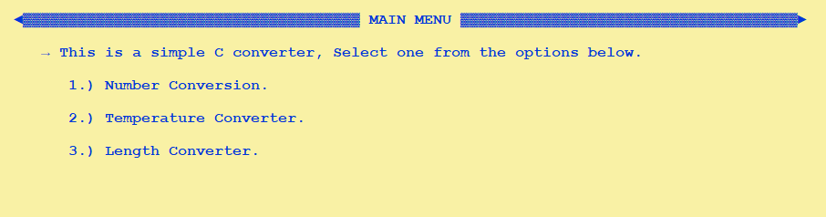
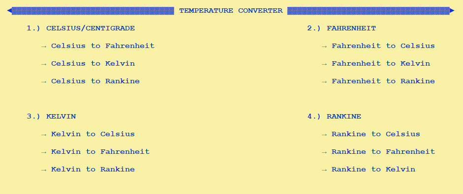
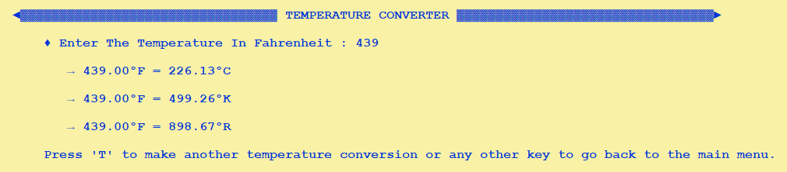
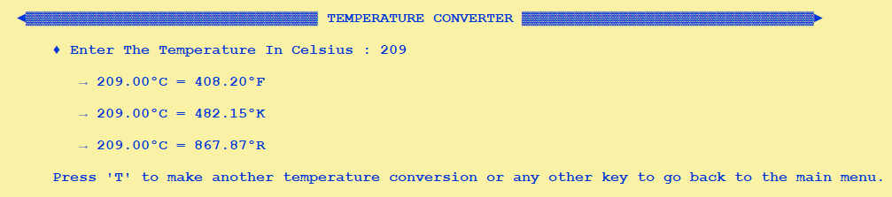
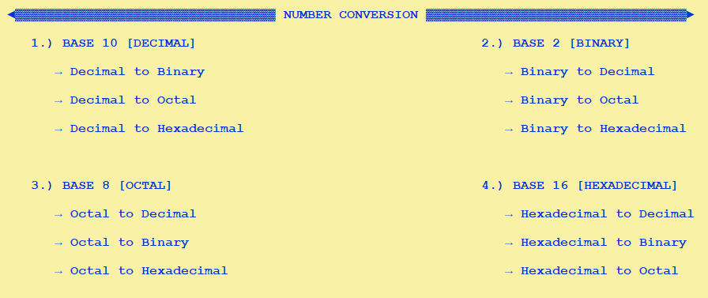
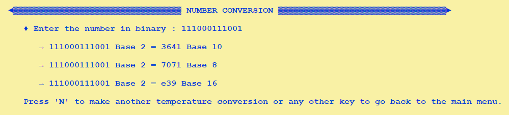
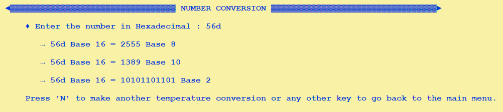
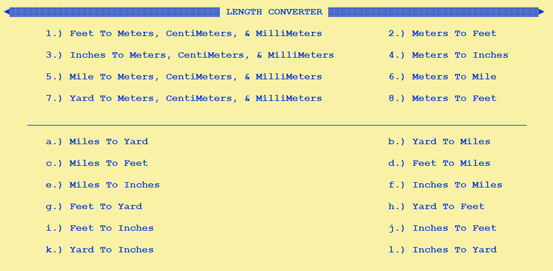
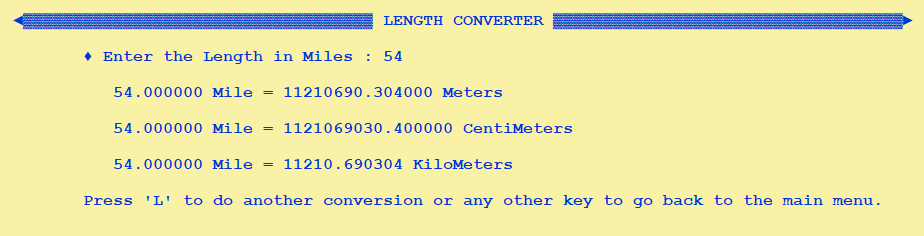
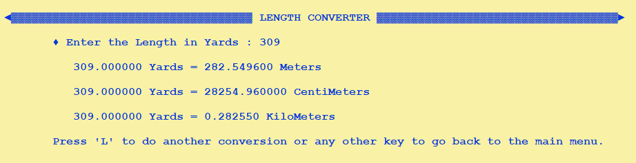

# Simple Converter in C.
* #### This project is a simple converter and it contains three different types of converters: temperature converter, number converter, and length converter.
   

1. ## Temperature Converter
   * **The temperature converter can convert temperatures between four different scales: Celsius, Fahrenheit, Kelvin, and Rankine.**
     
 
     

      

      

2. ## Number Converter
   * **The number converter can convert numbers between four different bases: Base 10 (decimal), Base 2 (binary), Base 8 (octal), and Base 16 (hexadecimal).**
   

     

      

      

3. ## Length Converter
   * **The length converter can convert lengths between various units, including inches, feet, meters, and more.**
   

   

   

   

### Files :
The project includes four ".c" files:

> 1. [x] **[main.c](main.c) :** The main program file that handles user input and calls the appropriate converter functions.
> 2. [x] **[temperature_converter.c](temperature_converter.c) :** Contains the functions for converting temperatures.
> 3. [x] **[number_converter.c](number_conversion.c) :** Contains the functions for converting numbers.
> 4. [x] **[length_converter.c](length_converter.c) :** Contains the functions for converting lengths.

> The project also includes a ".h" file in a folder called **"[headers](headers/essentials.h),"** which contains the declarations for the functions used in the project.